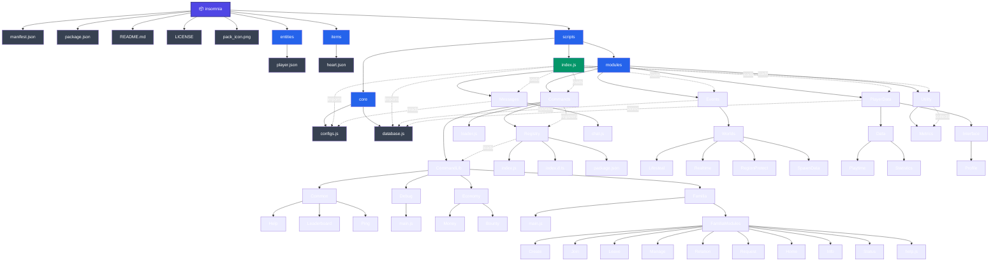

# Insomnia Core

```mermaid
flowchart TD
	classDef root fill:#4F46E5,color:#fff,stroke:#312E81,stroke-width:2px
	classDef folder fill:#2563EB,color:#fff
	classDef module fill:#059669,color:#fff
	classDef file fill:#374151,color:#fff

	A["📦 insomnia"]:::root

	A --> Manifest["manifest.json"]:::file
	A --> Package["package.json"]:::file
	A --> Readme["README.md"]:::file
	A --> License["LICENSE"]:::file
	A --> Icon["pack_icon.png"]:::file

	A --> Entities["entities"]:::folder
	A --> Items["items"]:::folder
	A --> Scripts["scripts"]:::folder

	Entities --> Player["player.json"]:::file
	Items --> Heart["heart.json"]:::file

	Scripts --> Index["index.js"]:::module
	Scripts --> Core["core"]:::folder
	Scripts --> Modules["modules"]:::folder

	Core --> Configs["configs.js"]:::file
	Core --> Database["database.js"]:::file

	Modules --> Commands
	Modules --> Events
	Modules --> Messages
	Modules --> PlayerData
	Modules --> Utility

%% ===========================
%% Commands
%% ===========================

	Commands --> Registry
	Commands --> CommandLib
	Commands --> Loader["loader.js"]

	Registry --> RegistryJS["index.js"]
	Registry --> RegistryDTS["index.d.ts"]
	Registry --> RegistryPkg["package.json"]

	CommandLib --> Common
	CommandLib --> Debug
	CommandLib --> Economy
	CommandLib --> Familia

	Common --> Help
	Common --> Leaderboard
	Common --> Ping

	Debug --> DebugMain["main.js"]

	Economy --> Money
	Economy --> Bounty

	Familia --> FamiliaMain["main.js"]
	Familia --> FamiliaModules

	FamiliaModules --> Create
	FamiliaModules --> Join
	FamiliaModules --> Leave
	FamiliaModules --> Manage
	FamiliaModules --> Relation
	FamiliaModules --> Request
	FamiliaModules --> Home
	FamiliaModules --> Info
	FamiliaModules --> Status
	FamiliaModules --> FamiliaHelp["help.js"]

%% ===========================
%% Events
%% ===========================

	Events --> Worlds

	Worlds --> Lifesteal
	Worlds --> Realtime
	Worlds --> RegionProtect
	Worlds --> SpawnData

%% ===========================
%% Messages
%% ===========================

	Messages --> Chat["chat.js"]

%% ===========================
%% Player
%% ===========================

	PlayerData --> Data
	PlayerData --> Interface

	Data --> Playtime
	Data --> Statistics

	Interface --> Profile

%% ===========================
%% Utility
%% ===========================

	Utility --> Metrics

%% ===========================
%% Runtime Flow
%% ===========================

	Index -.imports.-> Configs
	Index -.imports.-> Database
	Index -.loads.-> Commands
	Index -.loads.-> Events
	Index -.loads.-> Messages
	Index -.loads.-> PlayerData
	Index -.loads.-> Utility

	Commands -.registers.-> Registry
	Registry -.loads.-> CommandLib

	Events -.updates.-> Database
	PlayerData -.stores.-> Database
	Messages -.reads.-> Configs
	Utility -.collects.-> Metrics
```