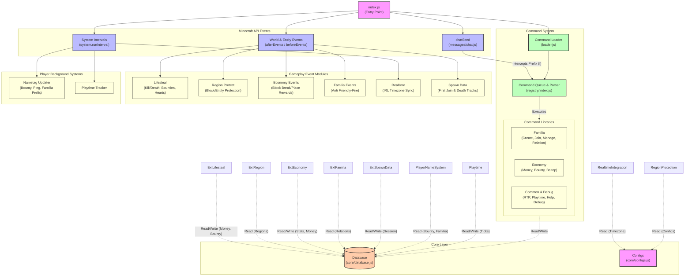

# Insomnia Core

  
  

Insomnia Core is a modular framework for Minecraft Bedrock Edition built on the Script API. It provides a scalable, event-driven architecture for building gameplay systems, managing player data, executing commands, and maintaining persistent storage through Minecraft Dynamic Properties.

Designed with modularity in mind, every subsystem operates independently while remaining connected through a centralized runtime. This architecture makes the project easy to maintain, extend, and integrate with new features without affecting existing modules.

## Architecture

The runtime begins with [scripts/index.js](https://github.com/KuroReichi/insomnia/blob/main/scripts/index.js), which initializes the configuration system, establishes the database connection, and subscribes to Minecraft server events.

Incoming events are dispatched to specialized modules responsible for gameplay mechanics, player tracking, and world management. Meanwhile, chat messages are processed through the command engine, where commands are parsed, validated, and executed before interacting with the database or configuration system.

Every module communicates through a centralized persistence layer, allowing data such as player statistics, economy, guild information, and world states to remain synchronized throughout the server lifecycle.

## Workflows

